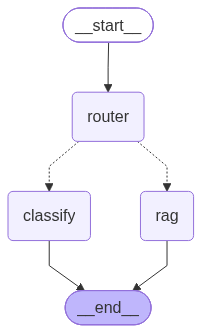

# Support Intelligence Platform

An agentic AI system for customer support. An LLM-powered router reads each
incoming message and decides whether to answer it from a knowledge base (RAG)
or classify it into a ticket category with a trained ML model.

## Architecture



The agent routes every question through a decision node:
- **Support questions** ("how do I get a refund?") → **RAG**: semantic retrieval
  over 26k support Q&As with FAISS, answered by an LLM grounded strictly in
  retrieved data (no hallucinated facts).
- **Classification requests** ("what category is this ticket?") → a
  **scikit-learn** classifier predicting one of 11 categories.

## Tech stack

- **Python**, **pandas** — data pipeline
- **sentence-transformers** (all-MiniLM-L6-v2) + **FAISS** — embeddings & vector search
- **Google Gemini** — grounded answer generation and routing
- **scikit-learn** (TF-IDF + Logistic Regression) — ticket classifier
- **MLflow** — experiment tracking
- **LangGraph** — agent orchestration (router → tools → response)

## Results

- Ticket classifier: 99.6% accuracy on held-out templated data
- RAG: grounded answers with no invented facts, drawn from retrieved examples

## Running it

```bash
python -m venv venv && source venv/bin/activate
pip install -r requirements.txt
# add GEMINI_API_KEY to a .env file
python src/agent.py
```

## Dataset

Bitext Customer Support dataset (~27k tagged support queries).
